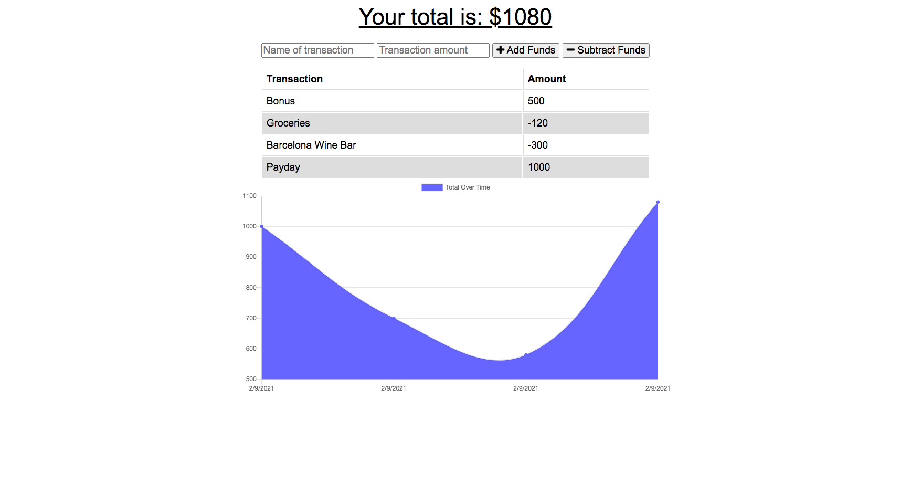

# Budget Tracker

## Description
[Budget Tracker](https://blooming-falls-14765.herokuapp.com/) is a web application designed to track increments and decrements of funds. Users can easily add and subtract funds which allows them to view a graph of all of their expenses as well as the total money they have left to spend. The magic of this application is the fact that it can be used online *and* offline by using IndexedDB. 

View the deployed app here: https://blooming-falls-14765.herokuapp.com/
## Budget Tracker

## Table of Contents
* [Installation](#installation)
* [Usage](#usage)
* [Credits](#credits)
* [Tests](#tests)
* [Questions](#questions)
* [License](#license)

## Installation
1. Go to the [GitHub repository for Budget Tracker](https://github.com/jeanarose/budget-tracker).
2. Click the green **Code** button.
3. Copy the SSH key.
4. In your terminal, go into the directory that you want to host Budget Tracker. 
5. Use the command **git clone [insert SSH key URL]** and click **Enter** (*Requires Git*).

## Usage
Budget Tracker is best utilized as a daily record of expenses and profits. 

## Credits
The following people contributed to the success of this application. You can view their GitHub profiles by clicking on their names:
* [Jonathan Watson](https://github.com/jonathanjwatson)
* [Peter Colella](https://github.com/petercolella)

## Tests
Interested in testing Budget Tracker?

1. Check to see that when you add or subtract a fund, the graph adjusts according to the data. 
2. Check to see that the total amount at the top of the page reflects the funds listed. 

## Questions
If you have any questions, you can contact me at jeanarose.mathis.dev@gmail.com. 
You can also view my GitHub profile at https://github.com/jeanarose.
## License
Copyright (c) 2021 Jeana Rose Mathis

MIT License
    
Permission is hereby granted, free of charge, to any person obtaining a copy
of this software and associated documentation files (the "Software"), to deal
in the Software without restriction, including without limitation the rights
to use, copy, modify, merge, publish, distribute, sublicense, and/or sell
copies of the Software, and to permit persons to whom the Software is
furnished to do so, subject to the following conditions:
    
The above copyright notice and this permission notice shall be included in all
copies or substantial portions of the Software.
    
THE SOFTWARE IS PROVIDED "AS IS", WITHOUT WARRANTY OF ANY KIND, EXPRESS OR
IMPLIED, INCLUDING BUT NOT LIMITED TO THE WARRANTIES OF MERCHANTABILITY,
FITNESS FOR A PARTICULAR PURPOSE AND NONINFRINGEMENT. IN NO EVENT SHALL THE
AUTHORS OR COPYRIGHT HOLDERS BE LIABLE FOR ANY CLAIM, DAMAGES OR OTHER
LIABILITY, WHETHER IN AN ACTION OF CONTRACT, TORT OR OTHERWISE, ARISING FROM,
OUT OF OR IN CONNECTION WITH THE SOFTWARE OR THE USE OR OTHER DEALINGS IN THE
SOFTWARE. 
  